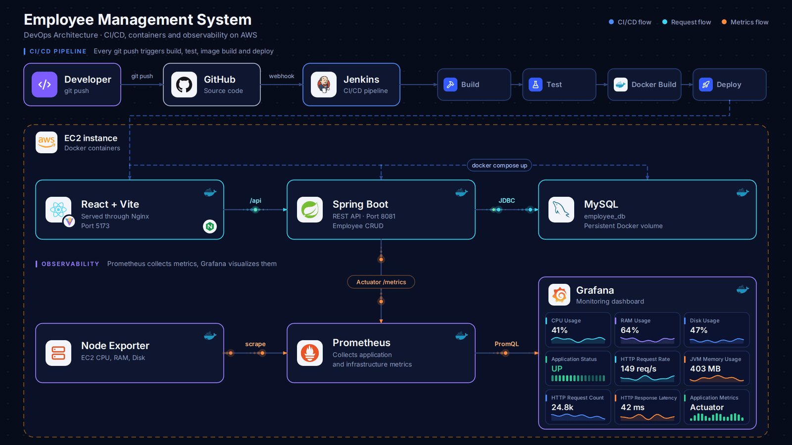

# 🚀 Employee Management DevOps Project

A complete end-to-end DevOps project for an Employee Management CRUD application with automated CI/CD, Docker containerization, AWS EC2 deployment, infrastructure monitoring, and application monitoring.

---

## 📌 Project Overview

This project demonstrates a complete DevOps lifecycle for an Employee Management CRUD application.

The project automates the process of:

* Source code management
* Continuous Integration
* Automated testing
* Docker image building
* Continuous Deployment
* AWS cloud deployment
* Infrastructure monitoring
* Application monitoring
* Metrics visualization

The project integrates **GitHub, Jenkins, Docker, Docker Compose, AWS EC2, Prometheus, Grafana, Node Exporter, Nginx, React, Spring Boot, and MySQL**.

---

## 🏗️ Architecture



### Architecture Flow

```text
Developer
    │
    │ git push
    ▼
GitHub
    │
    │ Webhook
    ▼
Jenkins CI/CD Pipeline
    │
    ├── Checkout
    ├── Build
    ├── Test
    ├── Docker Build
    └── Deploy
          │
          │ Docker Compose
          ▼
       AWS EC2
          │
     ┌────┴───────────────┐
     │                    │
     ▼                    ▼
React + Nginx       Spring Boot
Frontend            Backend API
     │                    │
     │ /api               │ JDBC
     └───────────────────▶│
                          ▼
                        MySQL
                     employee_db


Monitoring:

Node Exporter ─────────────┐
                           ▼
                       Prometheus
                           │
                           ▼
                        Grafana

Spring Boot
    │
    │ /actuator/prometheus
    ▼
Prometheus
```

---

# 🧩 Application Architecture

## Frontend

The frontend is developed using React and Vite and is served through Nginx.

Features include:

* React
* Vite
* Nginx
* Employee CRUD interface
* Dashboard
* Departments page
* API reverse proxy

---

## Backend

The backend is developed using Spring Boot.

Main technologies and components:

* Spring Boot
* Java 17
* REST API
* Spring Data JPA
* MySQL
* Spring Boot Actuator
* Prometheus metrics

The backend provides REST APIs for employee management and exposes application metrics through Spring Boot Actuator.

---

## Database

MySQL is used as the application database.

* MySQL 8.4
* Database: `employee_db`
* Persistent Docker volume

---

# 🔄 Employee CRUD API

The backend provides REST APIs for employee management.

| Method | Endpoint              | Description       |
| ------ | --------------------- | ----------------- |
| POST   | `/api/employees`      | Create employee   |
| GET    | `/api/employees`      | Get all employees |
| GET    | `/api/employees/{id}` | Get employee      |
| PUT    | `/api/employees/{id}` | Update employee   |
| DELETE | `/api/employees/{id}` | Delete employee   |

---

# 🔁 CI/CD Pipeline

Jenkins automatically performs the application build, testing, Docker image creation, and deployment.

```text
GitHub Push
     ↓
GitHub Webhook
     ↓
Jenkins
     ↓
Checkout
     ↓
Build Backend
     ↓
Run Tests
     ↓
Build Docker Images
     ↓
Deploy with Docker Compose
     ↓
AWS EC2
```

Every push to the `main` branch can trigger the Jenkins pipeline automatically through the GitHub webhook.

---

# 🐳 Docker

The application is containerized using Docker.

Docker Compose manages:

* MySQL
* Spring Boot Backend
* React + Nginx Frontend

### Start the application

```bash
docker compose up -d
```

### Check running containers

```bash
docker ps
```

### Stop the application

```bash
docker compose down
```

> `docker compose down` stops and removes the containers but keeps the named MySQL volume.

---

# ☁️ AWS Deployment

The application is deployed on an AWS EC2 instance.

The EC2 instance runs the application and monitoring containers using Docker.

### Main Services

| Service       | Port |
| ------------- | ---: |
| Frontend      | 5173 |
| Backend       | 8081 |
| Jenkins       | 8080 |
| Prometheus    | 9090 |
| Grafana       | 3000 |
| Node Exporter | 9100 |

---

# 📊 Monitoring

Prometheus and Grafana are used to monitor both infrastructure and application metrics.

---

## Node Exporter

Node Exporter collects EC2 infrastructure metrics such as:

* CPU usage
* RAM usage
* Disk usage

Example CPU query:

```promql
100 - (avg by(instance) (rate(node_cpu_seconds_total{mode="idle"}[5m])) * 100)
```

Example RAM query:

```promql
(1 - (node_memory_MemAvailable_bytes / node_memory_MemTotal_bytes)) * 100
```

---

## Spring Boot Actuator

Spring Boot Actuator exposes application metrics through:

```text
/actuator/prometheus
```

Prometheus collects these application metrics for monitoring.

---

## Prometheus

Prometheus collects and stores metrics from:

* Node Exporter
* Spring Boot application
* Prometheus itself

The Prometheus scrape interval is configured to collect metrics periodically from the monitored services.

---

## Grafana

Grafana visualizes the collected metrics through monitoring dashboards.

### Application Monitoring

The dashboard includes:

* Application Status
* HTTP Request Rate
* JVM Memory Usage
* HTTP Request Count
* HTTP Response Latency
* Application Metrics

### Infrastructure Monitoring

The dashboard includes:

* CPU Usage
* RAM Usage
* Disk Usage

---

# 🔐 Security

Sensitive information is not stored directly in the Git repository.

Environment variables and Jenkins credentials are used for sensitive values such as database passwords.

Example Spring Boot configuration:

```properties
spring.datasource.password=${DB_PASSWORD}
```

The `.env` file is excluded from Git using `.gitignore`.

```gitignore
.env
frontend/.env
```

Jenkins uses a secure credential for the database password during deployment.

---

# 🛠️ Technologies Used

## Development

* Java 17
* Spring Boot
* React
* Vite
* MySQL
* Spring Data JPA

## DevOps

* Git
* GitHub
* Jenkins
* Docker
* Docker Compose
* Nginx

## Cloud

* AWS EC2

## Monitoring

* Prometheus
* Grafana
* Node Exporter
* Spring Boot Actuator

---

# ✨ Project Features

* Employee CRUD operations
* REST API
* React dashboard
* Departments page
* MySQL database
* Docker containerization
* Docker Compose orchestration
* Automated Jenkins CI/CD
* GitHub webhook integration
* Automated application build
* Automated testing
* Automated Docker image build
* Automated deployment
* AWS EC2 deployment
* Nginx reverse proxy
* Infrastructure monitoring
* Application monitoring
* Grafana dashboards
* Prometheus metrics
* Node Exporter monitoring
* Spring Boot Actuator metrics
* Secure environment-based configuration
* Persistent MySQL Docker volume

---

# 📁 Project Structure

```text
employee-management/
│
├── src/
│   └── main/
│       ├── java/
│       │   └── employee_management/
│       │       ├── controller/
│       │       ├── entity/
│       │       ├── repository/
│       │       └── service/
│       │
│       └── resources/
│           └── application.properties
│
├── frontend/
│   ├── src/
│   ├── Dockerfile
│   ├── nginx.conf
│   ├── package.json
│   └── .dockerignore
│
├── Dockerfile
├── docker-compose.yml
├── Jenkinsfile
├── pom.xml
├── mvnw
├── .gitignore
└── README.md
```

---

# 🚀 Running the Project Locally

## Prerequisites

Install the following:

* Java 17
* Maven
* Node.js
* npm
* MySQL
* Docker
* Docker Compose
* Git

---

## Clone the Repository

```bash
git clone https://github.com/Hirunodhya2003/employee-management-devops.git
```

```bash
cd employee-management-devops
```

---

## Configure Environment Variables

Database credentials should be provided through environment variables instead of storing them in source code.

Example:

```bash
export DB_PASSWORD="YOUR_MYSQL_PASSWORD"
```

For Docker Compose, configure the required environment variable securely.

---

## Start with Docker Compose

```bash
docker compose up -d
```

Check the containers:

```bash
docker ps
```

---

# 🌐 Application Access

After deployment, the application can be accessed through the frontend service.

```text
Frontend:
http://EC2_PUBLIC_IP:5173
```

Jenkins:

```text
http://EC2_PUBLIC_IP:8080
```

Prometheus:

```text
http://EC2_PUBLIC_IP:9090
```

Grafana:

```text
http://EC2_PUBLIC_IP:3000
```

---

# 🔄 Complete DevOps Workflow

```text
Developer
    ↓
Code Changes
    ↓
Git Push
    ↓
GitHub
    ↓
GitHub Webhook
    ↓
Jenkins
    ↓
Checkout
    ↓
Build
    ↓
Test
    ↓
Docker Build
    ↓
Docker Compose Deploy
    ↓
AWS EC2
    ↓
Application
    ↓
Prometheus
    ↓
Grafana
```

---

# 🧪 Testing

Automated tests are executed as part of the Jenkins CI/CD pipeline.

The pipeline builds the Spring Boot application and runs the test suite before the deployment stage.

This helps ensure that application changes are validated before being deployed.

---

# 🎯 DevOps Concepts Demonstrated

This project demonstrates practical experience with:

* Version Control
* Git and GitHub
* Continuous Integration
* Continuous Deployment
* Jenkins Pipelines
* GitHub Webhooks
* Automated Testing
* Docker Containerization
* Docker Compose
* AWS EC2
* Nginx Reverse Proxy
* Environment Variables
* Secrets Management
* Prometheus Monitoring
* Grafana Visualization
* Node Exporter
* Application Observability
* Infrastructure Monitoring

---

# 📚 Learning Outcomes

Through this project, the following concepts were practiced:

1. Building a full-stack CRUD application
2. Managing source code using Git and GitHub
3. Creating Jenkins CI/CD pipelines
4. Automating application builds
5. Running automated tests
6. Containerizing applications with Docker
7. Managing multiple services with Docker Compose
8. Deploying applications to AWS EC2
9. Configuring Nginx as a reverse proxy
10. Collecting infrastructure metrics with Node Exporter
11. Collecting application metrics with Spring Boot Actuator
12. Storing metrics with Prometheus
13. Creating monitoring dashboards with Grafana
14. Managing sensitive configuration securely

---

# 🎯 Project Goal

The goal of this project is to demonstrate a complete DevOps lifecycle by integrating source control, CI/CD automation, automated testing, containerization, cloud deployment, and monitoring into a single application.

---

# 👩‍💻 Author

**Kavishi Hirunodhya**

GitHub:
https://github.com/Hirunodhya2003

---

# ⭐ Project Summary

This project demonstrates an end-to-end DevOps workflow where application code is automatically built, tested, containerized, deployed to AWS EC2, and monitored using Prometheus and Grafana.

```text
GitHub
   ↓
Jenkins
   ↓
Build + Test
   ↓
Docker
   ↓
AWS EC2
   ↓
Employee Management Application
   ↓
Prometheus
   ↓
Grafana
```

---
